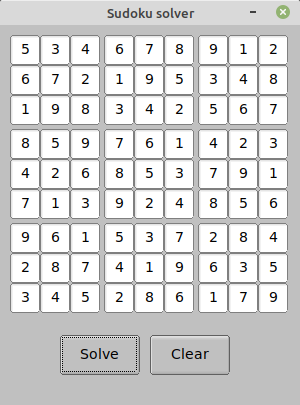

# Sudoku solver in Rust.

### This is a small application which can solve sudoku puzzles.

You type in the numbers from a sudoku puzzle and click the solve button. 
then the application fills in the missing numbers if the puzzle is solvable.  

The program has been developed using Rust, and [fltk-rs](https://github.com/MoAlyousef/fltk-rs) as GUI.  

### This is how it looks like when the program is started:

### Fill in some numbers from a sudoku like this:

### Click Solve and here is the result:

